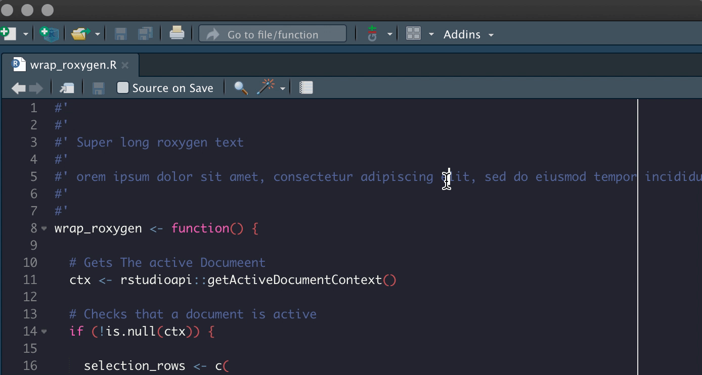

<!-- README.md is generated from README.Rmd. Please edit that file -->

# ehhaddins

<!-- badges: start -->

<!-- badges: end -->

The goal of ehhaddins is to host various personal addins.

## Installation

You can install the the development version from
[GitHub](https://github.com/) with:

``` r
# install.packages("devtools")
devtools::install_github("EmilHvitfeldt/ehhaddins")
```

## Addins

  - `find_todo` Will find and list all instances of the word “TODO”
    inside a project.
  - `wrap_roxygen` Wraps selected line to fit inside 80 character width.

## Demo gifs

### wrap\_roxygen



## Code of Conduct

Please note that the ‘ehhaddins’ project is released with a [Contributor
Code of Conduct](CODE_OF_CONDUCT.md). By contributing to this project,
you agree to abide by its terms.
