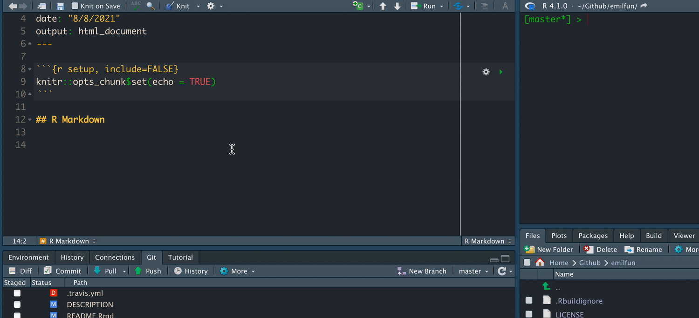

<!-- README.md is generated from README.Rmd. Please edit that file -->

# emiladdins

<!-- badges: start -->

[](https://github.com/EmilHvitfeldt/ehhaddins/actions)
<!-- badges: end -->

The goal of emiladdins is to host various personal addins.

## Installation

You can install the the development version from
[GitHub](https://github.com/) with:

``` r
# install.packages("devtools")
devtools::install_github("EmilHvitfeldt/emiladdins")
```

## Addins

-   `wrap_roxygen` Wraps selected line to fit inside 80 character width.
-   `delete_comments` Deletes comments in selection.
-   `bender_rule` Inserts #benderrule footnote.
-   `find_todo` Will find and list all instances of the word “TODO”
    inside a project.
-   `twitter_link` Inserts formatted twitter link from clipboard.
-   `tidy_importfrom` takes all @importFrom statements and organizes
    them.

## Demo gifs

### wrap_roxygen


### delete_comments


### bender_rule


### find_todo


### twitter_link



### tidy_importfrom


## Code of Conduct

Please note that the ‘emiladdins’ project is released with a
[Contributor Code of Conduct](CODE_OF_CONDUCT.md). By contributing to
this project, you agree to abide by its terms.
